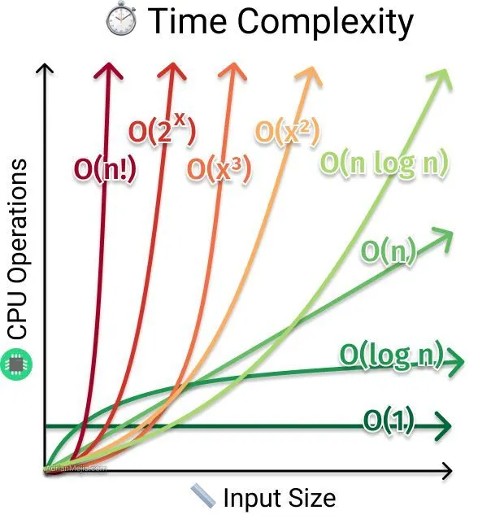

# ⏱️ A Beginner’s Guide to Time Complexity in Algorithms: O(1), O(n), O(n²), and Beyond



If you’ve ever tried to understand how efficient an algorithm is, you’ve likely encountered something called **time complexity**.

You may have seen scary-looking terms like `O(n)`, `O(log n)`, or even `O(n!)` in coding tutorials or interviews.

> ❓ But what do these terms actually mean? And why do we care about them?

Let’s break down time complexity into easy-to-understand terms and examples so you can confidently recognize algorithm efficiency.

---

## 📌 What is Time Complexity?

In simple terms, **time complexity** tells us how the running time of an algorithm grows as the size of the input (**n**) increases.

- If `n` grows, does runtime grow slowly or quickly?
- Does it scale efficiently for large inputs?

👉 Time complexity answers these questions.

---

## 📊 Big O Notation

The most common way to describe time complexity is using **Big O notation**.

---

## 🚀 Common Time Complexities

### 1. 🟢 O(1) — Constant Time

**Best case scenario** ✅

- Runtime does not change with input size

```java
int arr[] = {1, 2, 3};
int firstElement = arr[0];  // O(1)
```

✔ Accessing any index directly is constant time.

---

### 2. 🔵 O(log n) — Logarithmic Time

- Runtime increases slowly
- Problem size halves each step

#### Example: Binary Search

```java
int binarySearch(int[] arr, int target) {  // O(log n)
    int low = 0, high = arr.length - 1;
    while (low <= high) {
        int mid = low + (high - low) / 2;
        if (arr[mid] == target)
            return mid;
        if (arr[mid] < target)
            low = mid + 1;
        else
            high = mid - 1;
    }
    return -1;
}
```

✔ Extremely efficient for large sorted datasets.

---

### 3. 🟡 O(n) — Linear Time

- Runtime grows proportionally with input size

```java
for (int i = 0; i < arr.length; i++) {  // O(n)
    System.out.println(arr[i]);
}
```

✔ Common when iterating through all elements.

---

### 4. 🟠 O(n log n) — Linearithmic Time

- Faster than quadratic time
- Common in efficient sorting

#### Example: Merge Sort

```java
void mergeSort(int[] arr, int l, int r) {  // O(n log n)
    if (l < r) {
        int m = (l + r) / 2;
        mergeSort(arr, l, m);
        mergeSort(arr, m + 1, r);
        merge(arr, l, m, r);
    }
}
```

✔ Standard complexity for efficient general-purpose sorting.

---

### 5. 🔴 O(n²) — Quadratic Time

- Nested loops → very slow growth

```java
for (int i = 0; i < n; i++) {      // O(n^2)
    for (int j = 0; j < n; j++) {
        System.out.println(arr[i] + arr[j]);
    }
}
```

⚠️ Avoid for large datasets.

---

### 6. 🟣 O(2ⁿ) — Exponential Time

- Doubles with each additional input
- Becomes infeasible quickly

#### Example: Recursive Fibonacci

```java
int fibonacci(int n) {    // O(2^n)
    if (n <= 1)
        return n;
    return fibonacci(n - 1) + fibonacci(n - 2);
}
```

⚠️ Avoid when possible — optimize with DP or memoization.

---

### 7. ⚫ O(n!) — Factorial Time

- Worst-case complexity ❌
- Explores all permutations

```java
void permutations(int[] arr, int currentIndex) {    // O(n!)
    if (currentIndex == arr.length - 1) {
        System.out.println(Arrays.toString(arr));
    }

    for (int i = currentIndex; i < arr.length; i++) {
        swap(arr, i, currentIndex);
        permutations(arr, currentIndex + 1);
        swap(arr, i, currentIndex);  // backtrack
    }
}
```

⚠️ Extremely slow for even small inputs.

---

## 📌 Summary Table

| Complexity | Performance                       | Description |
|-----------|-----------------------------------|-------------|
| O(1) | ✅ The Best                        | Constant time |
| O(log n) | ✅ Efficient                       | Logarithmic growth |
| O(n) | ⚖️ Manageable for moderate inputs | Linear growth |
| O(n log n) | ✅ Good for efficient sorting      | Efficient sorting |
| O(n²) | ❌ Slow for large inputs           | Nested loops |
| O(2ⁿ) | ❌ Very slow. Avoid if possible!   | Exponential |
| O(n!) | ❌ Worst. Avoid if possible!       | Factorial |

---

[Source](https://medium.com/@n20/a-beginners-guide-to-time-complexity-in-algorithms-o-1-o-n-o-n%C2%B2-and-beyond-c15500c81583)
